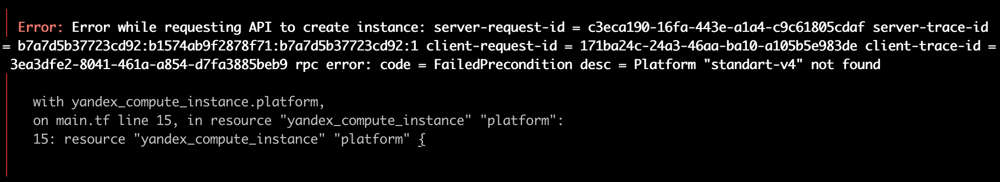
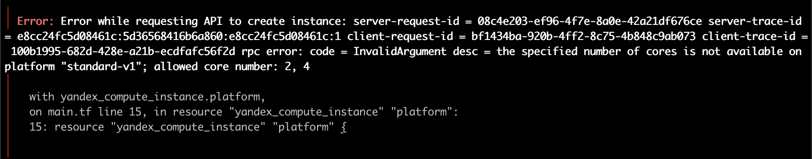
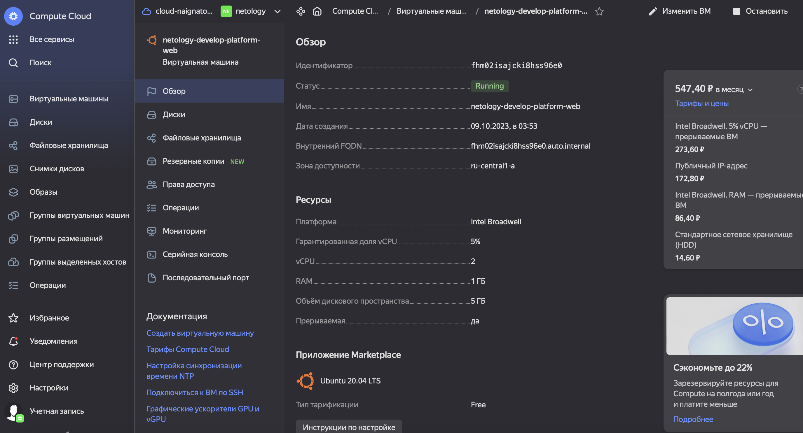
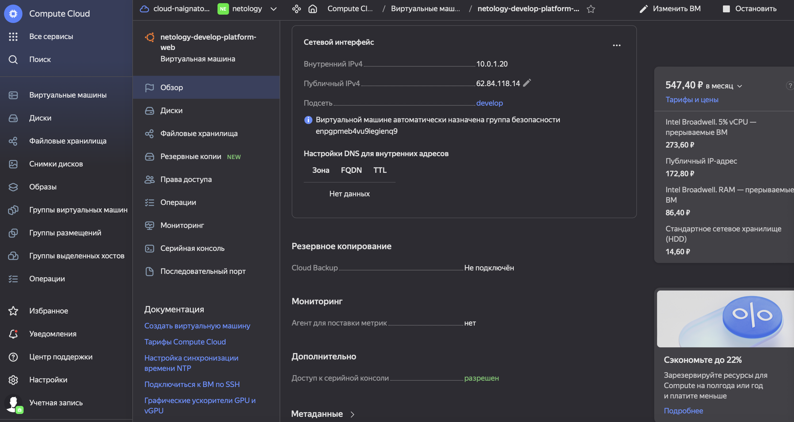
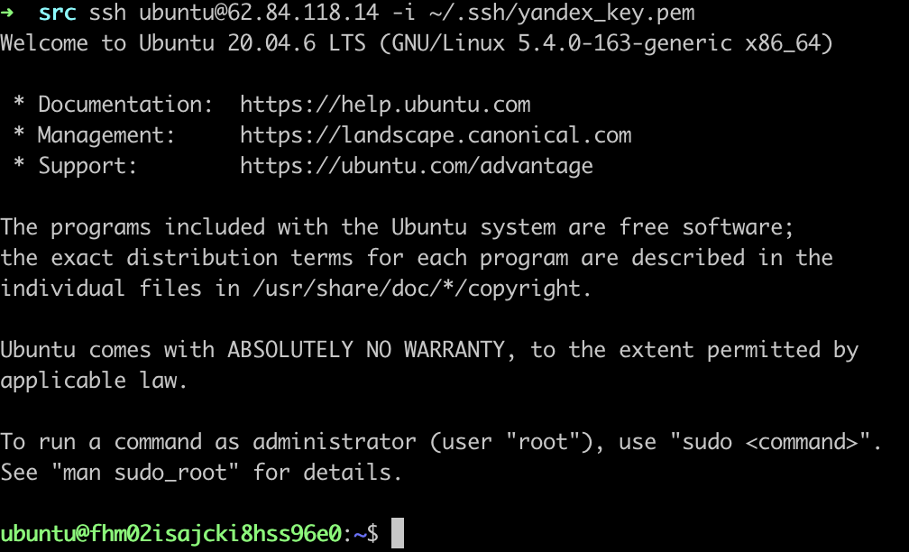
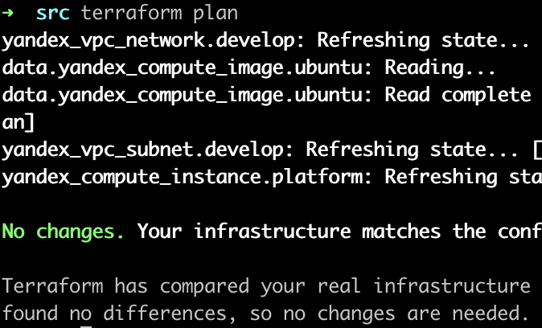
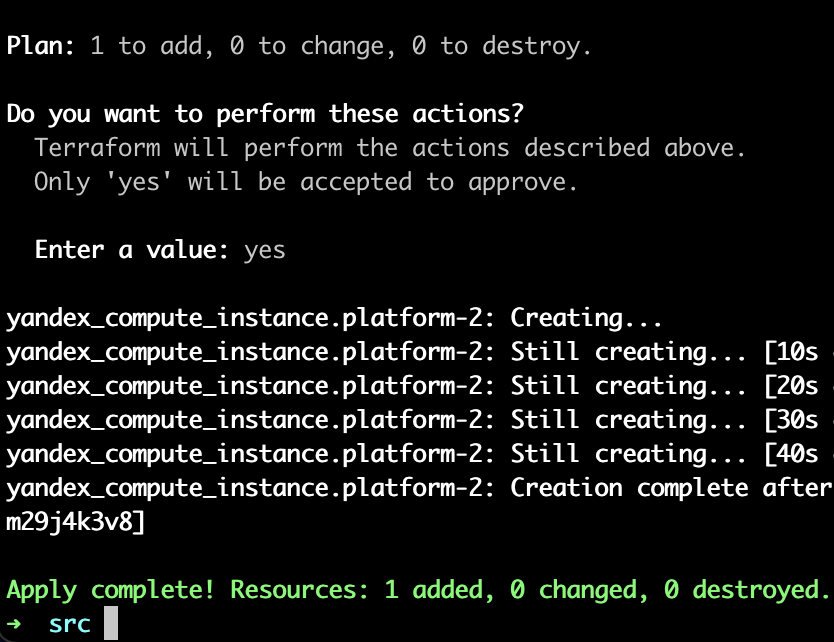
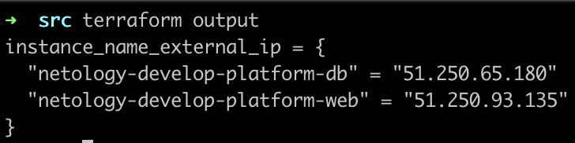
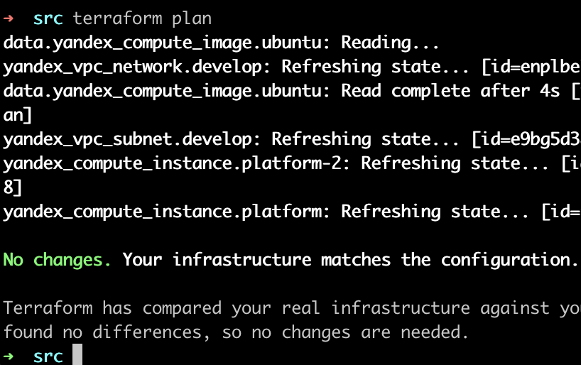
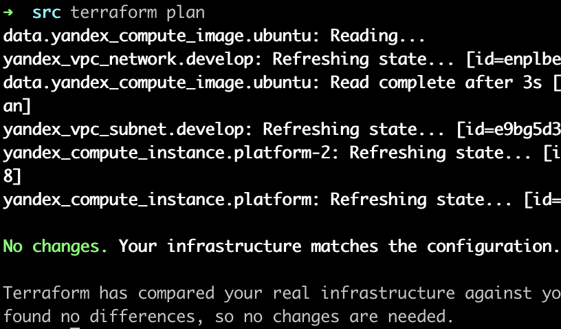

### Задание 1
В качестве ответа всегда полностью прикладывайте ваш terraform-код в git.

1. Изучите проект. В файле variables.tf объявлены переменные для Yandex provider.
2. Переименуйте файл personal.auto.tfvars_example в personal.auto.tfvars. Заполните переменные: идентификаторы облака, токен доступа. Благодаря .gitignore этот файл не попадёт в публичный репозиторий. **Вы можете выбрать иной способ безопасно передать секретные данные в terraform.**
3. Сгенерируйте или используйте свой текущий ssh-ключ. Запишите его открытую часть в переменную **vms_ssh_root_key**.
4. Инициализируйте проект, выполните код. Исправьте намеренно допущенные синтаксические ошибки. Ищите внимательно, посимвольно. Ответьте, в чём заключается их суть.



> 1. Стандарта версии 4 не существует, была выбрана версия "1"
> 2. В слове standard допущена опечатка ('t' вместо 'd')



> Для стандарта 1 допустимое значение ядер 2 или 4, не 1

5. Ответьте, как в процессе обучения могут пригодиться параметры ```preemptible = true``` и ```core_fraction=5``` в параметрах ВМ. Ответ в документации Yandex Cloud.

> Параметр preemtible используется для создания прерываемой машины - она расходует меньше денежных средств чем обычные, однако может быть остановлена в любой момент провайдером (в случае нехватки ресурсов в той же зоне доступности или после 24 часов работы)
> Параметр core_fraction позволяет использовать лишь заданный процент от производительности CPU (что тоже помогает экономить денежные средства)

В качестве решения приложите:

- скриншот ЛК Yandex Cloud с созданной ВМ;
- скриншот успешного подключения к консоли ВМ через ssh. К OS ubuntu необходимо подключаться под пользователем ubuntu: "ssh ubuntu@vm_ip_address";
- ответы на вопросы.







[Task 1 - main.tf](./assets/2-1/main.tf)

### Задание 2

1. Изучите файлы проекта.
2. Замените все хардкод-**значения** для ресурсов **yandex_compute_image** и **yandex_compute_instance** на **отдельные** переменные. К названиям переменных ВМ добавьте в начало префикс **vm_web_** .  Пример: **vm_web_name**.
2. Объявите нужные переменные в файле variables.tf, обязательно указывайте тип переменной. Заполните их **default** прежними значениями из main.tf. 
3. Проверьте terraform plan. Изменений быть не должно. 



[Task 2 - main.tf](./assets/2-2/main.tf)

[Task 2 - variables.tf](./assets/2-2/variables.tf)

### Задание 3

1. Создайте в корне проекта файл 'vms_platform.tf' . Перенесите в него все переменные первой ВМ.
2. Скопируйте блок ресурса и создайте с его помощью вторую ВМ в файле main.tf: **"netology-develop-platform-db"** ,  cores  = 2, memory = 2, core_fraction = 20. Объявите её переменные с префиксом **vm_db_** в том же файле ('vms_platform.tf').
3. Примените изменения.



[Task 3 - main.tf](./assets/2-3/main.tf)

[Task 3 - vms_platform.tf](./assets/2-3/vms_platform.tf)

### Задание 4

1. Объявите в файле outputs.tf output типа map, содержащий { instance_name = external_ip } для каждой из ВМ.
2. Примените изменения.

В качестве решения приложите вывод значений ip-адресов команды ```terraform output```.



[Task 4 - outputs.tf](./assets/2-4/outputs.tf)

### Задание 5

1. В файле locals.tf опишите в **одном** local-блоке имя каждой ВМ, используйте интерполяцию ${..} с несколькими переменными по примеру из лекции.
2. Замените переменные с именами ВМ из файла variables.tf на созданные вами local-переменные.
3. Примените изменения.



[Task 5 - locals.tf](./assets/2-5/locals.tf)

[Task 5 - main.tf](./assets/2-5/main.tf)

### Задание 6

1. Вместо использования трёх переменных  ".._cores",".._memory",".._core_fraction" в блоке  resources {...}, объедините их в переменные типа **map** с именами "vm_web_resources" и "vm_db_resources". В качестве продвинутой практики попробуйте создать одну map-переменную **vms_resources** и уже внутри неё конфиги обеих ВМ — вложенный map.
2. Также поступите с блоком **metadata {serial-port-enable, ssh-keys}**, эта переменная должна быть общая для всех ваших ВМ.
3. Найдите и удалите все более не используемые переменные проекта.
4. Проверьте terraform plan. Изменений быть не должно.



[Task 6 - vms_platform.tf](./assets/2-6/vms_platform.tf)

[Task 6 - variables.tf](./assets/2-6/variables.tf)

[Task 6 - main.tf](./assets/2-6/main.tf)