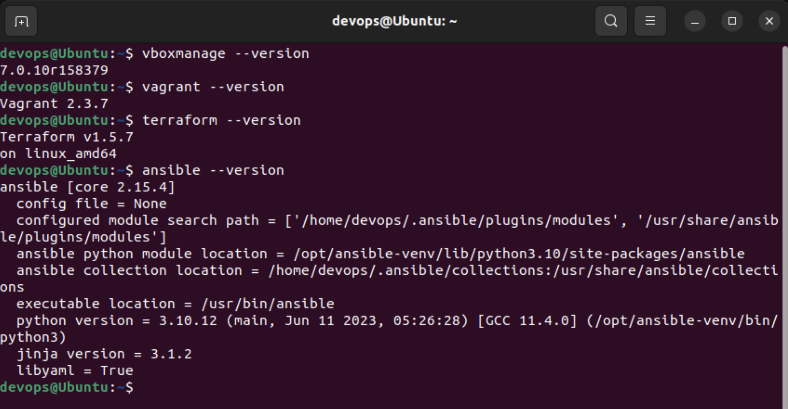
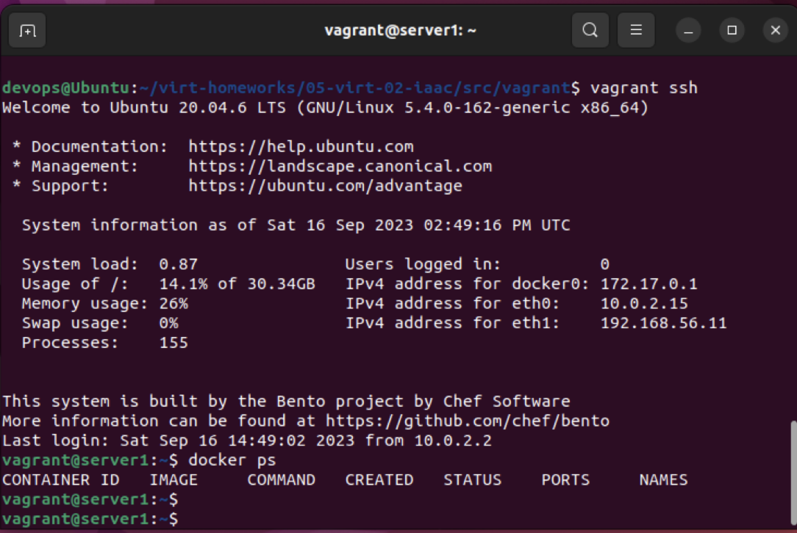

# Домашнее задание к занятию 2. «Применение принципов IaaC в работе с виртуальными машинами»

## Задача 1

- Опишите основные преимущества применения на практике IaaC-паттернов.

> Ускорение и увеличение эффективности разработки ПО (меньше времени и человекочасов затрачивается на развертывание и управление инфраструктурой), обеспечение стабильности и единства всех конфигураций (что может быть трудно достижимо при ручной настройке инфраструктуры в виду человеческого фактора)

- Какой из принципов IaaC является основополагающим?

> Имдепотентность - принцип, при котором каждый хост в инфрастуктуре, имеет одну и ту же конфигурацию при использовании одного IaaC-инструмента

## Задача 2

- Чем Ansible выгодно отличается от других систем управление конфигурациями?

> Ansible не требует установки агента на все управляемые хосты в инфраструктуре для конфигурации и настройки, что сильно их упрощает

- Какой, на ваш взгляд, метод работы систем конфигурации более надёжный — push или pull?

> Метод pull более надежен, так как при одновременной отправке конфигураций на хосты может перегрузиться сеть и мастер-хост

## Задача 3

Установите на личный компьютер:

- [VirtualBox](https://www.virtualbox.org/),
- [Vagrant](https://github.com/netology-code/devops-materials),
- [Terraform](https://github.com/netology-code/devops-materials/blob/master/README.md),
- Ansible.

*Приложите вывод команд установленных версий каждой из программ, оформленный в Markdown.*

```
devops@Ubuntu:~/virt-homeworks/05-virt-02-laac/src/vagrant$ ansible --version

ansible [core 2.15.4]
  config file = /home/devops/virt-homeworks/05-virt-02-iaac/src/vagrant/ansible.cfg
  configured module search path = ['/home/devops/.ansible/plugins/modules', '/home/devops/.ansible/plugins/modules']
  ansible python module location = /home/devops/.local/lib/python3.10/site-packages/ansible
  ansible collection location = /home/devops/.ansible/collections:/usr/share/ansible/collections
  executable location = /home/devops/.local/bin/ansible
  python version = 3.10.12 (main, Jun 11 2023, 05:26:28) [GCC 11.4.0] (/usr/bin/python3)
  jinja version = 3.1.2
  libyaml = True
```

```
devops@Ubuntu:~/virt-homeworks/05-virt-02-laac/src/vagrant$ vagrant --version

Vagrant 2.3.7
```

```
devops@Ubuntu:~/virt-homeworks/05-virt-02-laac/src/vagrant$ terraform --version

Terraform v1.5.7
on linux_amd64
```

```
devops@Ubuntu:~/virt-homeworks/05-virt-02-laac/src/vagrant$ vboxmanage --version

7.0.10r158379
```



## Задача 4 

Воспроизведите практическую часть лекции самостоятельно.

- Создайте виртуальную машину.
- Зайдите внутрь ВМ, убедитесь, что Docker установлен с помощью команды
```
docker ps,
```
Vagrantfile из лекции и код ansible находятся в [папке](https://github.com/netology-code/virt-homeworks/tree/virt-11/05-virt-02-iaac/src).

Примечание. Если Vagrant выдаёт ошибку:
```
URL: ["https://vagrantcloud.com/bento/ubuntu-20.04"]     
Error: The requested URL returned error: 404:
```

выполните следующие действия:

1. Скачайте с [сайта](https://app.vagrantup.com/bento/boxes/ubuntu-20.04) файл-образ "bento/ubuntu-20.04".
2. Добавьте его в список образов Vagrant: "vagrant box add bento/ubuntu-20.04 <путь к файлу>".



*Приложите скриншоты в качестве решения на эту задачу.*
