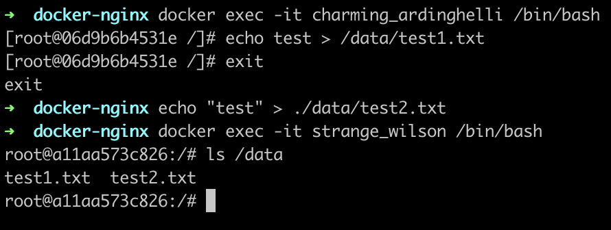

# Домашнее задание к занятию 3. «Введение. Экосистема. Архитектура. Жизненный цикл Docker-контейнера»

## Задача 1

Сценарий выполнения задачи:

- создайте свой репозиторий на https://hub.docker.com;
- выберите любой образ, который содержит веб-сервер Nginx;
- создайте свой fork образа;
- реализуйте функциональность:
запуск веб-сервера в фоне с индекс-страницей, содержащей HTML-код ниже:
```
<html>
<head>
Hey, Netology
</head>
<body>
<h1>I’m DevOps Engineer!</h1>
</body>
</html>
```

Опубликуйте созданный fork в своём репозитории и предоставьте ответ в виде ссылки на https://hub.docker.com/username_repo.

> docker pull ignatovskiy/devops_tasks:nginx

> https://hub.docker.com/layers/ignatovskiy/devops_tasks/nginx/images/sha256-b7c67bf5542e2a5c7fc211d44c093242858c9d2d647d4b94dd043a23346c45b8?context=explore

## Задача 2

Посмотрите на сценарий ниже и ответьте на вопрос:
«Подходит ли в этом сценарии использование Docker-контейнеров или лучше подойдёт виртуальная машина, физическая машина? Может быть, возможны разные варианты?»

Детально опишите и обоснуйте свой выбор.

--

Сценарий:

- высоконагруженное монолитное Java веб-приложение;

> Поскольку приложение монолитное нет смысла использовать Docker-контейнеры, соответственно наилучшим вариантом будет виртуальная или физическая машина

- Nodejs веб-приложение;

> Веб-приложение лучше всего расположить в Docker-контейнерах (это даст возможность load-balancing и доступности)

- мобильное приложение c версиями для Android и iOS;

> Мобильные приложения запускаются только в эмуляторах тяжелых в плане потребления ресурсов IDE, поэтому лучше использовать физические машины

- шина данных на базе Apache Kafka;

> Для обеспечения высокой проходимости шины данных и низкой задержки я бы использовал физическую машину

- Elasticsearch-кластер для реализации логирования продуктивного веб-приложения — три ноды elasticsearch, два logstash и две ноды kibana;

> В данном случае я бы использовал виртуальные машины

- мониторинг-стек на базе Prometheus и Grafana;

> Проще всего развернуть такой стек в Docker-контейнерах

- MongoDB как основное хранилище данных для Java-приложения;

> Как и в случае монолитного Java приложения здесь стоит использовать физическую или виртуальную машину

- Gitlab-сервер для реализации CI/CD-процессов и приватный (закрытый) Docker Registry.

> Такие масштабные и довольно тяжелые сервисы стоит разместить на физической или виртуальной машине

## Задача 3

- Запустите первый контейнер из образа ***centos*** c любым тегом в фоновом режиме, подключив папку ```/data``` из текущей рабочей директории на хостовой машине в ```/data``` контейнера.
- Запустите второй контейнер из образа ***debian*** в фоновом режиме, подключив папку ```/data``` из текущей рабочей директории на хостовой машине в ```/data``` контейнера.
- Подключитесь к первому контейнеру с помощью ```docker exec``` и создайте текстовый файл любого содержания в ```/data```.
- Добавьте ещё один файл в папку ```/data``` на хостовой машине.
- Подключитесь во второй контейнер и отобразите листинг и содержание файлов в ```/data``` контейнера.

```
➜  docker-nginx docker run -d -v ./data:/data -t centos
06d9b6b4531e659443e2e26992f10e2350111fa70cc9781b255b43f1dc6e2580

➜  docker-nginx docker run -d -v ./data:/data -t debian
a11aa573c826fa96f9affb4422d67118596e0653c6eb276884aa59585d10ace9

➜  docker-nginx docker ps
CONTAINER ID   IMAGE                         COMMAND                  CREATED          STATUS              PORTS     NAMES
a11aa573c826   debian                        "bash"                   3 seconds ago    Up 3 seconds                  strange_wilson
06d9b6b4531e   centos                        "/bin/bash"              10 seconds ago   Up 9 seconds                  charming_ardinghelli

➜  docker-nginx docker exec -it charming_ardinghelli /bin/bash
[root@06d9b6b4531e /]# echo test > /data/test1.txt
[root@06d9b6b4531e /]# exit
exit

➜  docker-nginx echo "test" > ./data/test2.txt

➜  docker-nginx docker exec -it strange_wilson /bin/bash
root@a11aa573c826:/# ls /data
test1.txt  test2.txt
```



## Задача 4 (*)

Воспроизведите практическую часть лекции самостоятельно.

Соберите Docker-образ с Ansible, загрузите на Docker Hub и пришлите ссылку вместе с остальными ответами к задачам.

> docker pull ignatovskiy/devops_tasks:ansible-docker

> https://hub.docker.com/layers/ignatovskiy/devops_tasks/ansible-docker/images/sha256-10eac1bc75d84c9a63825ca35fe0e166b026ea6aaaf0cac964668d91df27738b?context=explore


---

### Как cдавать задание

Выполненное домашнее задание пришлите ссылкой на .md-файл в вашем репозитории.

---
