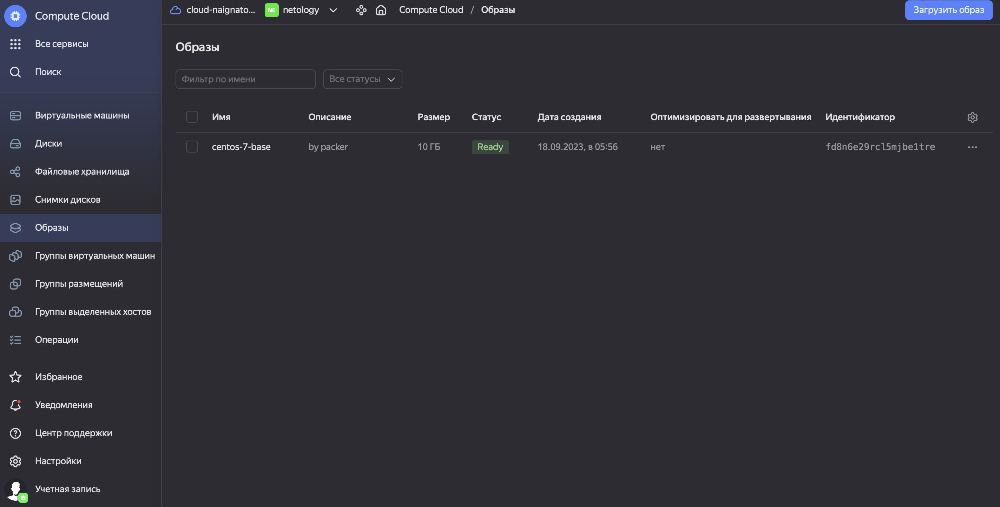
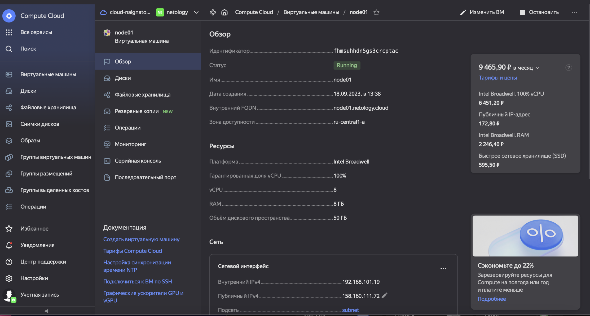
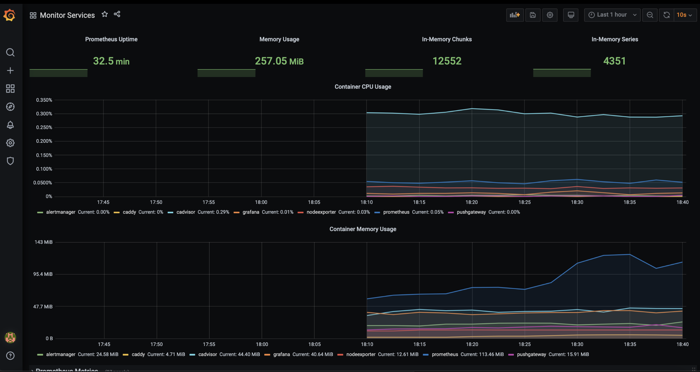

# Домашнее задание к занятию 4. «Оркестрация группой Docker-контейнеров на примере Docker Compose»

## Задача 1

Создайте собственный образ любой операционной системы (например, debian-11) с помощью Packer версии 1.5.0 ([инструкция](https://cloud.yandex.ru/docs/tutorials/infrastructure-management/packer-quickstart)).

Чтобы получить зачёт, вам нужно предоставить скриншот страницы с созданным образом из личного кабинета YandexCloud.



## Задача 2

**2.1.** Создайте вашу первую виртуальную машину в YandexCloud с помощью web-интерфейса YandexCloud.        

**2.2.*** **(Необязательное задание)**      
Создайте вашу первую виртуальную машину в YandexCloud с помощью Terraform (вместо использования веб-интерфейса YandexCloud).
Используйте Terraform-код в директории ([src/terraform](https://github.com/netology-group/virt-homeworks/tree/virt-11/05-virt-04-docker-compose/src/terraform)).

Чтобы получить зачёт, вам нужно предоставить вывод команды terraform apply и страницы свойств, созданной ВМ из личного кабинета YandexCloud.


```
yandex_vpc_network.default: Creating...
yandex_vpc_network.default: Creation complete after 5s [id=enpk3ld64h4kkb4g404n]
yandex_vpc_subnet.default: Creating...
yandex_vpc_subnet.default: Creation complete after 1s [id=e9b2dpkqoulj9mkirqke]
yandex_compute_instance.node01: Creating...
yandex_compute_instance.node01: Still creating... [10s elapsed]
yandex_compute_instance.node01: Still creating... [20s elapsed]
yandex_compute_instance.node01: Still creating... [30s elapsed]
yandex_compute_instance.node01: Still creating... [40s elapsed]
yandex_compute_instance.node01: Still creating... [50s elapsed]
yandex_compute_instance.node01: Still creating... [1m0s elapsed]
yandex_compute_instance.node01: Still creating... [1m10s elapsed]
yandex_compute_instance.node01: Still creating... [1m20s elapsed]
yandex_compute_instance.node01: Still creating... [1m30s elapsed]
yandex_compute_instance.node01: Creation complete after 1m32s [id=fhmsuhhdn5gs3crcptac]

Apply complete! Resources: 3 added, 0 changed, 0 destroyed.

Outputs:

external_ip_address_node01_yandex_cloud = "158.160.111.72"
internal_ip_address_node01_yandex_cloud = "192.168.101.19"
```



## Задача 3

С помощью Ansible и Docker Compose разверните на виртуальной машине из предыдущего задания систему мониторинга на основе Prometheus/Grafana.
Используйте Ansible-код в директории ([src/ansible](https://github.com/netology-group/virt-homeworks/tree/virt-11/05-virt-04-docker-compose/src/ansible)).

Чтобы получить зачёт, вам нужно предоставить вывод команды "docker ps" , все контейнеры, описанные в [docker-compose](https://github.com/netology-group/virt-homeworks/blob/virt-11/05-virt-04-docker-compose/src/ansible/stack/docker-compose.yaml),  должны быть в статусе "Up".

```
[centos@node01 ~]$ sudo docker ps
CONTAINER ID   IMAGE                              COMMAND                  CREATED         STATUS                   PORTS                                                                              NAMES
7008a78b16a5   prom/node-exporter:v0.18.1         "/bin/node_exporter …"   4 minutes ago   Up 4 minutes             9100/tcp                                                                           nodeexporter
ad3e69fb4cf5   gcr.io/cadvisor/cadvisor:v0.47.0   "/usr/bin/cadvisor -…"   4 minutes ago   Up 4 minutes (healthy)   8080/tcp                                                                           cadvisor
21bdadb8dd99   stefanprodan/caddy                 "/sbin/tini -- caddy…"   4 minutes ago   Up 4 minutes             0.0.0.0:3000->3000/tcp, 0.0.0.0:9090-9091->9090-9091/tcp, 0.0.0.0:9093->9093/tcp   caddy
3b56189d3023   grafana/grafana:7.4.2              "/run.sh"                4 minutes ago   Up 4 minutes             3000/tcp                                                                           grafana
9ec74ac32b32   prom/prometheus:v2.17.1            "/bin/prometheus --c…"   4 minutes ago   Up 4 minutes             9090/tcp                                                                           prometheus
da79c424b2e1   prom/alertmanager:v0.20.0          "/bin/alertmanager -…"   4 minutes ago   Up 4 minutes             9093/tcp                                                                           alertmanager
06bcd7ae9fdd   prom/pushgateway:v1.2.0            "/bin/pushgateway"       4 minutes ago   Up 4 minutes             9091/tcp                                                                           pushgateway
```

## Задача 4

1. Откройте веб-браузер, зайдите на страницу http://<внешний_ip_адрес_вашей_ВМ>:3000.
2. Используйте для авторизации логин и пароль из [.env-file](https://github.com/netology-group/virt-homeworks/blob/virt-11/05-virt-04-docker-compose/src/ansible/stack/.env).
3. Изучите доступный интерфейс, найдите в интерфейсе автоматически созданные docker-compose-панели с графиками([dashboards](https://grafana.com/docs/grafana/latest/dashboards/use-dashboards/)).
4. Подождите 5-10 минут, чтобы система мониторинга успела накопить данные.

Чтобы получить зачёт, предоставьте: 

- скриншот работающего веб-интерфейса Grafana с текущими метриками

> 

## Задача 5 (*)

Создайте вторую ВМ и подключите её к мониторингу, развёрнутому на первом сервере.

Чтобы получить зачёт, предоставьте:

- скриншот из Grafana, на котором будут отображаться метрики добавленного вами сервера.

