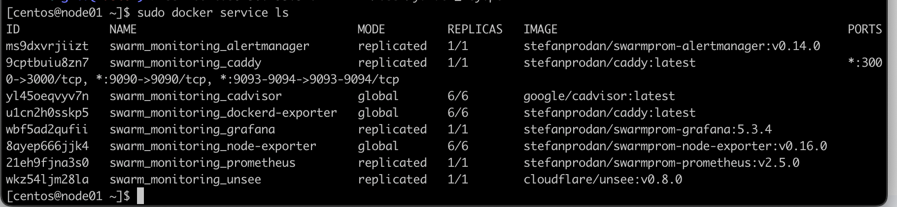

# Домашнее задание к занятию 5. «Оркестрация кластером Docker контейнеров на примере Docker Swarm»

## Задача 1

Дайте письменые ответы на вопросы:

- В чём отличие режимов работы сервисов в Docker Swarm-кластере: replication и global?

> replication: сервис разворачивает заданное вручную количество реплик контейнера на доступных узлах Docker Swarm-кластера. Кластер будет поддерживать такое количество реплик при их выходе из строя.

> global: сервис запускает контейнеры на каждом из уздов Docker Swarm-кластера (ручная настройка количества реплик не требуется). На каждом узле может быть >= 1 реплики сервиса

- Какой алгоритм выбора лидера используется в Docker Swarm-кластере?

> Raft - каждый узел в данном алгоритме имеет голос, лидером назначается узел, получивший наибольшее количество голосов. При равенстве голосов голосование повторяется.

- Что такое Overlay Network?

> изолированная виртуальная сеть для сетевой связности контейнеров из разных узлов (виртуальных либо физических) Docker Swarm-кластера

## Задача 2

Создайте ваш первый Docker Swarm-кластер в Яндекс Облаке.

Чтобы получить зачёт, предоставьте скриншот из терминала (консоли) с выводом команды:
```
docker node ls
```

```
[centos@node01 ~]$ sudo docker node ls
ID                            HOSTNAME             STATUS    AVAILABILITY   MANAGER STATUS   ENGINE VERSION
c2rx1nzudkifbz83yhonhlgw2 *   node01.netology.yc   Ready     Active         Leader           24.0.6
n59tb1x8vi0gatirtdq96nvcp     node02.netology.yc   Ready     Active         Reachable        24.0.6
p41mw4xfnvc5p00pqiauqalhe     node03.netology.yc   Ready     Active         Reachable        24.0.6
40qnsw8acjo49qavarkvudxs0     node04.netology.yc   Ready     Active                          24.0.6
93ke5ykvt2s89vykyhu0z121z     node05.netology.yc   Ready     Active                          24.0.6
khzpwblqada3fco2vvxv09grv     node06.netology.yc   Ready     Active                          24.0.6
```


## Задача 3

Создайте ваш первый, готовый к боевой эксплуатации кластер мониторинга, состоящий из стека микросервисов.

Чтобы получить зачёт, предоставьте скриншот из терминала (консоли), с выводом команды:
```
docker service ls
```

```
[centos@node01 ~]$ sudo docker service ls
ID             NAME                                MODE         REPLICAS   IMAGE                                          PORTS
ms9dxvrjiizt   swarm_monitoring_alertmanager       replicated   1/1        stefanprodan/swarmprom-alertmanager:v0.14.0
9cptbuiu8zn7   swarm_monitoring_caddy              replicated   1/1        stefanprodan/caddy:latest                      *:3000->3000/tcp, *:9090->9090/tcp, *:9093-9094->9093-9094/tcp
yl45oeqvyv7n   swarm_monitoring_cadvisor           global       6/6        google/cadvisor:latest
u1cn2h0sskp5   swarm_monitoring_dockerd-exporter   global       6/6        stefanprodan/caddy:latest
wbf5ad2qufii   swarm_monitoring_grafana            replicated   1/1        stefanprodan/swarmprom-grafana:5.3.4
8ayep666jjk4   swarm_monitoring_node-exporter      global       6/6        stefanprodan/swarmprom-node-exporter:v0.16.0
21eh9fjna3s0   swarm_monitoring_prometheus         replicated   1/1        stefanprodan/swarmprom-prometheus:v2.5.0
wkz54ljm28la   swarm_monitoring_unsee              replicated   1/1        cloudflare/unsee:v0.8.0
```



## Задача 4 (*)

Выполните на лидере Docker Swarm-кластера команду, указанную ниже, и дайте письменное описание её функционала — что она делает и зачем нужна:
```
# см.документацию: https://docs.docker.com/engine/swarm/swarm_manager_locking/
docker swarm update --autolock=true
```


